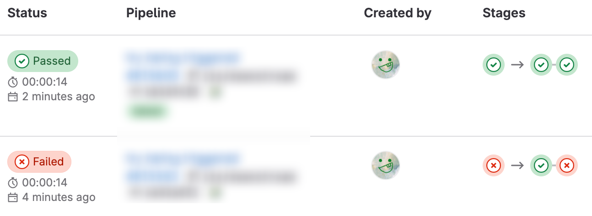

# GitLab CI 触发下游 Pipeline

GitLab 中可以通过 API 触发一个 repo 的 pipeline，这可以通过 API token 也可以通过 pipeline trigger token。

除此之外，还可以在 Job 中通过 `trigger` 关键字触发一个 pipeline；这会让 pipeline 的界面中显示被 trigger 的下游 pipeline，比较漂亮。



但是 `trigger` 使用时无法提供额外的 token 用来鉴权，而要求触发上游 job 的用户有权限触发下游 pipeline；而根据 [文档](https://docs.gitlab.com/ee/user/permissions.html#gitlab-cicd-permissions:~:text=Run%20CI/CD%20pipeline%20for%20a%20protected%20branch)，「有在下游 repo 触发 pipeline 的权限」等价于「有权限 merge 到对应 branch」。

文档在 [Downstream pipelines](https://docs.gitlab.com/ee/ci/pipelines/downstream_pipelines.html) 而非 [Trigger a pipeline](https://docs.gitlab.com/ee/ci/triggers/)。

一个样例：

```yaml
trigger_downstream_pipeline:
  stage: test
  trigger:
    project: group/subgroup/project
    branch: master
    strategy: depend  # 表示会等待下游 pipeline 完成并反映其状态
  variables:
    KEY1: value1
    KEY2: value2
```

而下游可以也可以通过 predefined variables 判断自己是如何被触发的，比如：

```yaml
  rules:
    - if: $CI_PIPELINE_SOURCE == "pipeline"  # triggered by upstream multi-project pipeline
```

(注意：如果是同一个 repo 中的上下游 pipeline，`$CI_PIPELINE_SOURCE` 在被触发的 pipeline 中是 `"parent_pipeline"`，参见 [文档](https://docs.gitlab.com/ee/ci/pipelines/downstream_pipelines.html?tab=Multi-project+pipeline#run-child-pipelines-with-merge-request-pipelines)。)
